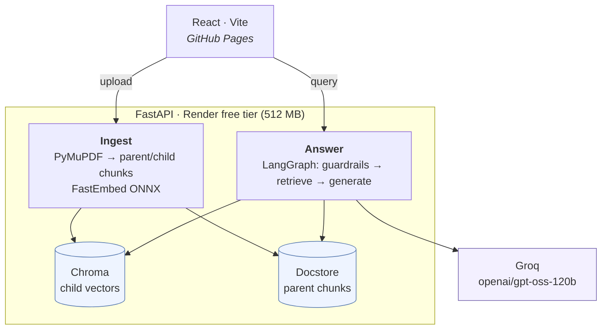
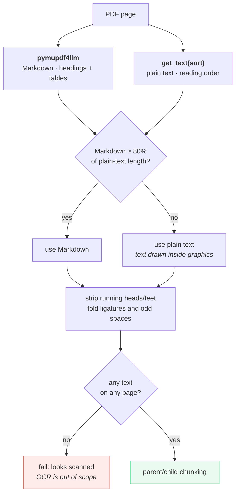
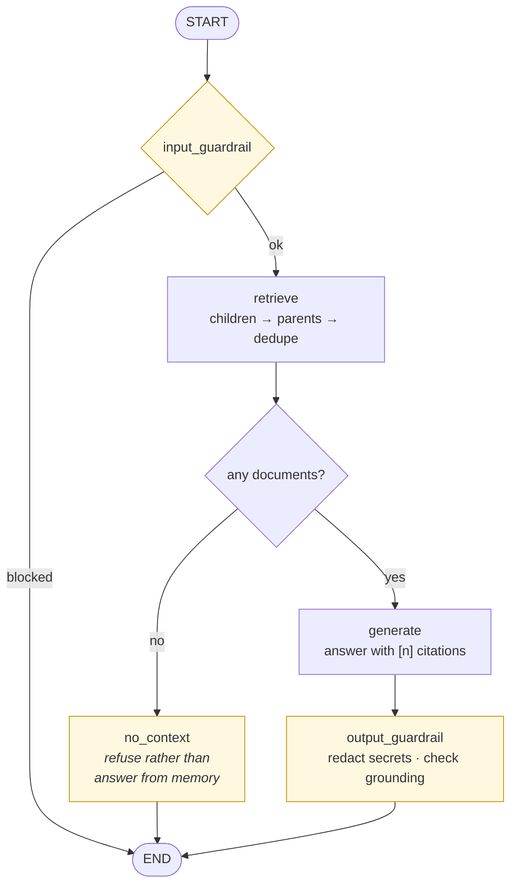

# RAG Vector-DB Assistant

A retrieval-augmented-generation app built with **LangChain**, **LangGraph**,
**ChromaDB**, and a **React** frontend. It ingests PDF / Word / text documents,
creates embeddings, and answers questions grounded in the retrieved context —
using the **parent-child (small-to-big) retrieval algorithm** and **input /
output guardrails**.

**Live app:** [akshayjaitly.github.io/langchain-rag-assistant](https://akshayjaitly.github.io/langchain-rag-assistant/)

**Backend health:** [langchain-rag-assistant-tw27.onrender.com/api/health](https://langchain-rag-assistant-tw27.onrender.com/api/health)



Embeddings run inside the backend process, so no embedding API is called and no
document text leaves the host except the retrieved context sent to Groq.

## Key pieces

| Concern | Implementation |
| --- | --- |
| Frontend | React 18 + Vite 6, deployed to GitHub Pages |
| Backend | FastAPI, deployed to Render |
| Vector DB | ChromaDB with a file-backed parent document store |
| Hosted embeddings | FastEmbed `BAAI/bge-small-en-v1.5` (local to the backend, no embedding API) |
| Local embeddings | Hugging Face `sentence-transformers/all-MiniLM-L6-v2` by default |
| Parent-child retrieval | LangChain `ParentDocumentRetriever` — embed small chunks, return larger parent chunks |
| Orchestration | LangGraph `StateGraph` with conditional guardrail edges |
| Hosted generation | Groq `openai/gpt-oss-120b` |
| Other providers | Anthropic, OpenAI, and local Ollama are configurable |
| Observability | LangSmith traces in project `pr-puzzled-robot-90` |
| Guardrails | Input injection/size checks, no-context refusal, secret redaction, and grounding checks |
| Parsing | `pymupdf` + `pymupdf4llm` (PDF), `docx2txt` (Word), `TextLoader` (txt/md) |
| UI persistence | Display name, avatar, theme, and the latest 100 messages in browser `localStorage` |

### The parent-child algorithm

Documents are split into **large parent chunks** and **small child chunks**.
Only the children are embedded (small chunks retrieve more precisely). At query
time we search the children, then hand the LLM their **parent** chunks so it has
the surrounding context. Parents live in a file-backed docstore; children live
in Chroma.

### PDF parsing

Plain `pypdf` extraction was losing real content: multi-column pages came back
interleaved, table rows arrived as run-on words (`Time2h`), and ligatures
survived as single codepoints (`confirmation`), which keyword-level retrieval
never matches. Ingestion now runs on PyMuPDF and extracts every page twice,
keeping whichever result is better:



The fallback is the point. `pymupdf4llm` alone silently drops whole sections on
pages whose text is drawn inside graphics — one sample itinerary loses its
entire DEPART/ARRIVE block that way. Measured across six sample PDFs, the hybrid
extracts more text than `pypdf` did on every one, and the only tokens it "loses"
are `pypdf`'s own run-together artifacts.

OCR is deliberately out of scope: a scanned PDF now fails with a clear message
rather than indexing an empty document.

### The LangGraph pipeline

The hosted deployment currently uses `PIPELINE=simple`:



An optional corrective pipeline is available with `PIPELINE=multi_agent`:


The multi-agent pipeline adds relevance grading and answer verification, but it
also adds model calls and latency. Keep the simple pipeline as the production
default until both versions have been compared with a LangSmith evaluation
dataset.


## Operational notes

### Catching a retired upstream model

Groq retired `llama-3.3-70b-versatile` while this app was deployed. Generation
failed on every request, but `/api/health` kept reporting `ok` because it only
echoed configuration, and the browser could not even read the error: FastAPI
produces its default 500 *above* the CORS middleware, so the response carried no
`Access-Control-Allow-Origin` header and `fetch` could only report
`Failed to fetch`.

Both holes are now closed:

- The backend makes one cheap generation call at startup and reports the result
  as `health.llm_status`. A retired or misconfigured model surfaces at deploy
  time, and the UI shows an amber "model unavailable" pill instead of claiming
  to be connected.
- Unhandled errors are caught *inside* the CORS layer, so the real provider
  error reaches the UI.

### Running in 512 MB

`ParentDocumentRetriever.add_documents` embeds every child chunk of everything
it is handed in a single call, which is enough to OOM the free tier on a
multi-page PDF. Ingestion therefore feeds it `INGEST_BATCH_SIZE` pages at a
time, FastEmbed runs with a small batch size on one thread, and
`OMP_NUM_THREADS=1` keeps ONNX Runtime from allocating per-thread arenas.

Two other free-tier behaviours are worth knowing:

- **The disk is ephemeral.** Uploaded documents and the Chroma index are wiped
  by every redeploy. The index is a demo of the pipeline, not storage.
- **The instance sleeps** after roughly 15 idle minutes and takes up to a minute
  to wake. The UI retries health on a backoff and shows "waking backend…" rather
  than reporting the backend as offline.

### Embeddings are not interchangeable

The hosted backend uses FastEmbed ONNX (`BAAI/bge-small-en-v1.5`) because torch
does not fit in 512 MB; local development defaults to
`sentence-transformers/all-MiniLM-L6-v2`. The two produce different vectors, so
a Chroma store built locally cannot be served by the hosted backend — reindex
after switching backends.

## Prerequisites

- Python 3.11 or 3.12
- Node.js 20+
- One generation provider: Anthropic, OpenAI, Groq, or local Ollama

## Backend setup

```bash
cd backend
python3 -m venv .venv && source .venv/bin/activate
pip install -r requirements.txt
cp .env.example .env          # choose LLM_PROVIDER and set its API key
uvicorn app.main:app --reload --port 8000
```

The first run downloads the selected embedding model and caches it locally.
Interactive API documentation is available at `http://localhost:8000/docs`.

## Frontend setup

```bash
cd frontend
npm ci
npm run dev                    # http://localhost:5173 (proxies /api → :8000)
```

## Using it

1. Open `http://localhost:5173`.
2. Upload a PDF / Word / text file (left panel) — it is parsed, chunked,
   embedded, and indexed.
3. Ask a question. The answer is grounded in retrieved chunks, shows its
   sources, and displays which guardrails fired.
4. Use the profile control in the top-right corner to select an included avatar
   or upload a custom image.

Profile settings and chat history currently persist only in the browser. They
are not authenticated, shared between devices, or supplied to LangGraph as
conversation memory.

## API

| Method | Path | Body | Purpose |
| --- | --- | --- | --- |
| GET | `/api/health` | – | Provider, model, embeddings, pipeline, tracing status, and `llm_status` from the startup model probe |
| GET | `/api/documents` | – | List documents in the current backend index |
| POST | `/api/upload` | multipart `file` | Parse, embed, and index a document; returns `pages_without_text` so a partly-scanned PDF is visible |
| POST | `/api/query` | `{"question": "..."}` | Answer, sources, guardrails, blocked status, and LangSmith `trace_id` |

## Configuration

All settings are environment variables (see `backend/.env.example`): model,
chunk sizes, retrieval `k`, persistence directories, CORS origins.

## LangSmith tracing

The backend emits one LangSmith trace per `/api/query` request, with child runs
for the LangGraph nodes, retriever, and model calls. Traces are tagged with the
environment, pipeline, and model provider and include retrieval configuration
as metadata.

1. Create a LangSmith API key at
   [smith.langchain.com](https://smith.langchain.com).
2. Set `LANGSMITH_API_KEY` as a secret in the Render service.
3. Keep `LANGSMITH_TRACING=true`. The Render Blueprint already sets the
   production project to `pr-puzzled-robot-90` and enables tracing.
4. If the key can access multiple LangSmith workspaces, also set
   `LANGSMITH_WORKSPACE_ID`.

`LANGSMITH_HIDE_INPUTS` and `LANGSMITH_HIDE_OUTPUTS` default to `true`, so
uploaded document content, questions, and answers are not sent in trace
payloads. For a non-sensitive demo, set them to `false` to inspect prompts,
retrieved context, and generated answers in LangSmith.

## Choosing the generation model

Set `LLM_PROVIDER` in `backend/.env`:

| `LLM_PROVIDER` | Cost      | Setup                                                            |
| -------------- | --------- | --------------------------------------------------------------- |
| `anthropic`    | paid API  | Set `ANTHROPIC_API_KEY`; pick `LLM_MODEL` (`claude-haiku-4-5` = cheapest, `claude-sonnet-5` = balanced, `claude-opus-5` = best). |
| `openai`       | paid API  | Set `OPENAI_API_KEY`; pick `OPENAI_MODEL` (default `gpt-4o-mini`). |
| `groq`         | **free**  | Free key at [console.groq.com](https://console.groq.com); set `GROQ_API_KEY` and `GROQ_MODEL` (default `openai/gpt-oss-120b`). Ideal for a $0 always-on deploy. Groq retires models regularly — check `GET /api/models` on their API if `health.llm_status` reports `model_not_found`. |
| `ollama`       | **free**  | Install [Ollama](https://ollama.com), run `ollama pull llama3.1:8b`, set `OLLAMA_MODEL`. No API key; local only (won't fit free cloud tiers). |

## Deploying (free)

GitHub Pages hosts the **frontend** (static, no secrets). The **backend** runs
on any Python host; secrets live there as server-side env vars, never in the
bundle.

1. **Backend → Render (free):** In Render, *New → Blueprint*, connect this repo
   (it reads [`render.yaml`](render.yaml)). Set `GROQ_API_KEY` and
   `LANGSMITH_API_KEY` in the dashboard as secret environment variables. The
   current backend is
   `https://langchain-rag-assistant-tw27.onrender.com`. Note that environment
   variables already set in the Render dashboard **override** `render.yaml`, so
   changing a model there means changing it in the dashboard too.
2. **Frontend → point it at the backend:** add an Actions repository variable
   named `VITE_API_BASE` with the full Render URL (repo *Settings → Secrets and
   variables → Actions → Variables*).
3. **GitHub Pages:** under *Settings → Pages → Build and deployment*, choose
   **GitHub Actions** as the source. Pushes that change `frontend/` or the Pages
   workflow then rebuild and publish the site automatically.
4. **CORS:** already set to `https://akshayjaitly.github.io` in `render.yaml`;
   change it if your Pages origin differs.

> Free-tier note: the Render service can spin down while idle and does not have
> a persistent disk. Uploaded files, Chroma vectors, the parent docstore, and
> the document manifest can therefore disappear after a restart or redeploy.
> Production persistence requires a persistent disk or a managed vector store.

Embeddings are always local (free); only generation differs. To go fully
offline at $0:

```bash
# .env
LLM_PROVIDER=ollama
OLLAMA_MODEL=llama3.1:8b
```

## Working Site Preview(local)


## Langsmith dash


## Notes

- Embeddings run locally, so re-indexing and retrieval cost nothing.
- Guardrails here are intentionally lightweight/heuristic — for production,
  consider a dedicated moderation model and a stricter faithfulness grader.
- The current browser history is presentation persistence, not LangGraph
  conversational memory. Server-side threads require a LangGraph checkpointer
  and authenticated storage.
